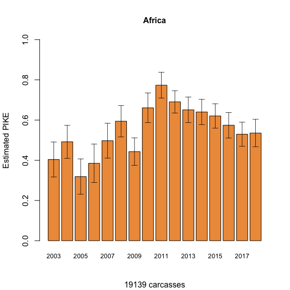
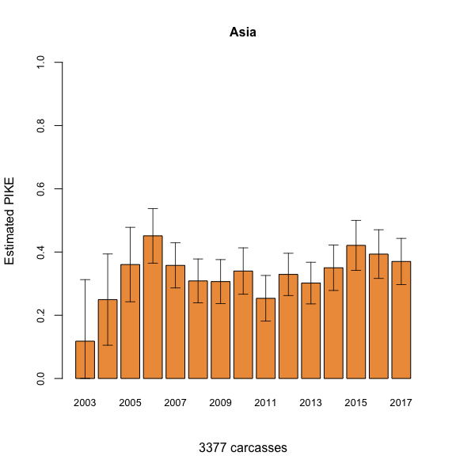

PIKE TREND ANALYSIS USING THE LEAST-SQUARES MEANS APPROACH
================
CITES MIKE PROGRAMME – CENTRAL COORDINATION UNIT (CCU)
August 1, 2019

  


  


### INTRODUCTION

MIKE analytical method used to determine PIKE trends as reported to the
15th, 16th, 17th and 18th meetings of the Conference of the Parties to
CITES:

  - CoP15, Doha, 2010, in document CoP15 Doc. 44.2 (Rev. 1);
  - CoP16, Bangkok, 2013, in document CoP16 Doc. 53.1;
  - CoP17, Johannesburg, 2016, in document CoP17 Doc. 57.5; and
  - CoP18, Geneva, 2019, in document CoP18 Doc. 69.2 and CoP18 Doc. 69.2
    Addendum

And the 61st, 62nd, 65th, 66th, 69th and 70th meetings of the CITES
Standing Committee:

  - SC61, Geneva, 2011, in document SC61 Doc 44.2 (Rev. 1) and its Annex
    1
  - SC62, Geneva, 2012, in document SC62 Doc 46.1 (Rev. 1) and its Annex
    1
  - SC65, Geneva, 2014, in document SC65 Doc. 42.1
  - SC66, Geneva, 2016, in document SC66 Doc. 47.1
  - SC69, Geneva, 2017, in document SC69 Doc. 51.1 and its Annex
  - SC70, Russian Federation, in document SC70 Doc. 49.1 and its Annex 1

### MIKE DATA

The MIKE program has 68 designated MIKE sites across 32 range states in
Africa. MIKE sites are distributed between four sub-regions: Central,
Eastern, Southern and West Africa, following the designations outlined
in the International Union for Conservation of Nature Species Survival
Commission (IUCN/SSC) African Elephants Specialist Group (AfESG) African
Elephant Database and derived status reports. In Asia, the programme has
29 MIKE sites in 13 countries across South and South East Asia.

Designated MIKE sites represent elephant populations of different sizes
(numbering less than 100 elephants to populations with tens of thousands
of elephants) and in markedly different ecotones (from deserts to
tropical rainforests). A large number of elephant populations in MIKE
sites in Central and West Africa occur in forested ecosystems that can
influence the number of elephant carcasses being reported due to
challenges relating to locating carcasses. The populations in West
Africa also tend to be small and therefore fewer deaths are reported.

In general, both ecological and management factors combine to create
high variation in the number of carcasses reported per year and gaps in
reporting.

### PIKE INDICATOR

MIKE evaluates relative poaching levels based on the Proportion of
Illegally Killed Elephants (PIKE), which is calculated as the number of
illegally killed elephants found divided by the total number of elephant
carcasses encountered, aggregated by site and across year:

\(PIKE_{st} = {IC_{st}\over TC_{st}},\)

where the IC is the number of illegally killed carcasses and TC is the
total number of carcasses detected. The subscript s refers to site and t
to year. PIKE is assumed to represent an effort free metric of the
relative causes of elephant death in a population.

While PIKE provides a robust measure of broad-scale poaching trends, it
may be affected by a number of potential biases related to data quality,
variation in carcass detection probabilities, variation in natural
mortality rates and other factors (Burns et al. 2011).

### CONTINENTAL AND REGIONAL PIKE TREND

The current approach for summarizing and inferring continental trend
from MIKE data modells the Proportion of Illegally Killed Elephants
(PIKE), specifically the probability of an illegally killed carcass
dependent on the total number of detected carcasses, using a weighted
linear regression framework with PIKE as the response variable and with
year and sub-region as categorical variables; in R, such variables are
referred as factors. Algebraically, the PIKE estimate as a function of
year and subregion can be expressed as:

PIKE = Year + Subregion

where subregion refers to the four African sub-regions mentioned above
and the weights are the total number of carcasses (TC) . This weighting
scheme was implemented to ensure inference was more strongly influenced
by sites with better sampling (or, conversely, poorly sampled sites had
less influence on model predictions).

The annual PIKE estimates, based on least-squares means predictions, are
determined by averaging across sub-regions while partially accounting
for imbalances in reporting. The marginal means are estimates of the
expected response for specific levels of a factor by averaging across
all levels of other factors.

A good introduction to least-squares means is given in Lenth (2018).

The continental analysis for Asia parallels that for Africa.

The subregional PIKE estimate is also determined using a weighted linear
regression model with each subregion modelled independently of each
other. The PIKE estimate of a subregion is modelled as a function of
year and country, where country refers to the location of the MIKE site
and the weights are the total number of carcasses (TC). The
least-squares means predictions, across countries, give the annual
subregional PIKE values, and its confidence bands. The same method is
applied separately for each subregion. No subregional trends are
estimated for South and Southeast Asia due to low carcass numbers and
infrequent reporting.

The analysis is in R using LSMEANS function from the DoBy library
(Højsgaard & Ulrich Halekoh, 2018).

## Implementation in R

The R code for LS means approach for analyzing the Monitoring of the
Illegal Killing of Elephants (MIKE) carcass data to derive continental
and subregional proportion of illegal killing of elephants (PIKE)
follows.

### Preprocessing steps

Load the required libraries.

``` r
library(gplots) # for barplot2
library(doBy)   # for LSMEANS
library(dplyr)  # for data manipulation
library(knitr)
```

To simplify the coding, a function \(PIKE.LSmeans\) is defined. This
user-defined function calculates LS means estimates, the 90% confidence
interval, and trims the estimates so that they fall between 0-1.

``` r
#### Define function PIKE.LSmeans  #####

# ----------- Define SAS-type LS MEANS  -----------
PIKE.LSmeans <- function(lm.obj) {
  # Purpose: Define SAS-type LS MEANS 
  # Purpose: Calculate  marginal means & ci for the effect year ("yr")
  # usage: lm.obj <- lm(pike~subregionid+yr,data=carcdat,weights=totcarc) or 
  # usage: lm.obj <- lm(pike~ccode+yr, data = ....) for regional estimates
  # usage: To call function: PIKE.LSmeans(lm.obj)
  
  require(doBy) # load LSmeans() funtion
  
  # calcluate lsmeans estimates by year ("yr")
  lsmns <- LSmeans(lm.obj, c("yr")) 
  
  # calculate the ci using 90% CI with infinite df
  upper.ci <- lsmns$coef[,1] + qnorm(.05,lower.tail=F)*lsmns$coef[,2] 
  lower.ci <- lsmns$coef[,1] - qnorm(.05,lower.tail=F)*lsmns$coef[,2]
  

  # bound the upper & lower ci between 0-1
  upper.ci <- ifelse(upper.ci > 1, 1, upper.ci)
  upper.ci <- ifelse(upper.ci < 0, 0, upper.ci)
  
  lower.ci <- ifelse(lower.ci > 1, 1, lower.ci)
  lower.ci <- ifelse(lower.ci < 0, 0, lower.ci)
  
  # bound pike estimate to be positive
  lsmns$coef$estimate <-ifelse(lsmns$coef$estimate < 0, 0, lsmns$coef$estimate)
  
  # append ci to model results 
  lsmns$coef <- cbind(lsmns$coef,lower.ci, upper.ci)
  lsmns
}
### end of functions
```

### Import and prepare the data

For the analysis a single data file is required. It contains aggregated
total number of carcasses and the total number that were illegally
killed per year for a specific site. This data is publicly available
from the following site:
<https://cites.org/eng/prog/mike/data_and_reports#MIKE%20Data%20Analysis>

The data is read in using the \(read.csv()\) function and stored in a
data frame (\(carcdat\)):

``` r
# set file name
file.name <- file.path("data/190307_PikeStatsUpTo2018FusionTableFormat.csv")
EC.df <- read.csv(file.name) # aggregated counts
```

As part of preparing the data the variable names are shorten and rows
where the total number of carcasses equals zero are excluded. Data from
2003 and onwards is used in the analysis. The MIKE KSG and any sites
that have reported only once, and the new MIKE site are not part of the
analysis. \(PIKE\) is calculated applying the following equation:
\[PIKE = \frac{\text{Number of carcasses killed illegally}}{\text{Total number of carcasses}}\]

and a new column \(yr\) (year) is assigned as a categorical variable.
Finally, MIKE sites from Africa are selected.

``` r
carcdat <- rename(EC.df,
            siteid =  MIKEsiteID,
            illegal = NumberOfIllegalCarcasses,
            totcarc = TotalNumberOfCarcasses,
            subregionid = SubregionID,
            un_region = UNRegion,
            ccode = CountryCode)

# remove any rows where the total number of carcasses  reported is zero
carcdat <- filter(carcdat, totcarc>0)

# Select sites with  year > 2002
carcdat <- filter(carcdat, year > 2002) 
# Select sites that have reported more than once (count > 1)
carcdat <- group_by(carcdat, siteid) %>% mutate(count=n()) %>%
           filter (count>1) %>%
           ungroup()
# JB: KSG infl. point removed
carcdat <- filter(carcdat, siteid != "KSG") 

#new MIKE sites added in 2018: KFE, LGL, LZN, MAN, MJT, NLW and SMN
newMIKESites <- c("KFE","LGL","LZN","MAN", "MJT", "NLW", "SMN")
# exclude  newMIKEsites data for this analysis
carcdat <- filter(carcdat, !(siteid %in% newMIKESites)) 

# prepare data -  convert year to factor and calculate PIKE index
carcdat$yr   <- as.factor(carcdat$year)
carcdat$pike <- carcdat$illegal/carcdat$totcarc # PIKE index

#copy the data to  data frame carcdat.all 
carcdat.all <- carcdat

# Select MIKE sites in Africa 
carcdat  <- carcdat[carcdat$un_region=='Africa',]
carcdat  <- droplevels(carcdat) 
```

### Continental PIKE Estimate for Africa

Apply the LS means to the weighted linear regression model, where PIKE
is the response variable and year (yr) and sub-region (subregionid) are
factors. The weights in the linear model are the total number of
carcasses (totcars). The LS means \(PIKE\) estimates are saved in file
“output/af\_lsmns\_90CL.csv”.

``` r
#  weighted linear regression model with covariates subregion and year, 
#  weighted by total number of carcasses
af.lm <- lm(pike ~ subregionid + yr, data=carcdat, weights=totcarc)

# call PIKE.LSmeans function, see above
af_lsmns <- PIKE.LSmeans(af.lm)

# write LS means coefs to disk
res <- data.frame(region="Africa", af_lsmns$coef,  af_lsmns$grid)
write.table(res,"output/af_lsmns_90CL.csv", sep=',', row.names=F)
```

#### Plot continental trend

Plot of the continental wide PIKE estimate and its 90% confidence
interval across years.

``` r
par(mfrow=c(1,1))
# include the total number of carcases in the subtitle
subtitle <- paste(sum(carcdat$totcarc), 'carcasses', sep=' ')

barplot2(af_lsmns$coef[,1], names.arg=af_lsmns$grid[,1], 
         plot.ci=TRUE, 
         ci.l=af_lsmns$coef[,6],
         ci.u=af_lsmns$coef[,7], 
         main="Africa",
         sub=subtitle,
         ylim=c(0,1), cex.main=1, cex.names=0.8, 
         cex.axis=1.0, ci.lwd=.8, 
         ylab='Estimated PIKE', col="tan2")
```

<!-- -->

### Subregional PIKE estimates

The PIKE estimate of a subregion model includes year and country, where
country refers to the location of the MIKE site and the weights are the
total number of carcasses. For each subregion, the LM means predictions,
across countries, give the annual PIKE estimate and its confidence
bands. The PIKE estimates are saved in the file “output/sr\_lsmsn.csv”.

The four subregions in Africa are coded as: FC - Central, FE - Eastern,
FS - Southern, FW - West

``` r
##### Subregional LS means weighted by sample size ##### 
fc.data  <- carcdat[carcdat$subregionid=='FC',] #subset data
fc.lm    <- lm(pike~ccode+yr, data=fc.data, weights=totcarc)
fc_lsmns <- PIKE.LSmeans(fc.lm)

fe.data  <- carcdat[carcdat$subregionid=='FE',]#subset data
fe.lm    <- lm(pike~ccode+yr, data=fe.data, weights=totcarc)
fe_lsmns <- PIKE.LSmeans(fe.lm)

fs.data  <- carcdat[carcdat$subregionid=='FS',]#subset data
fs.lm    <- lm(pike~ccode+yr, data=fs.data, weights=totcarc)
fs_lsmns <- PIKE.LSmeans(fs.lm)

fw.data  <- carcdat[carcdat$subregionid=='FW',]#subset data
fw.lm    <- lm(pike~ccode+yr,data=fw.data, weights=totcarc)
fw_lsmns <- PIKE.LSmeans(fw.lm)

#create subregional ids: fc, fe, fs & fw
fc_id <- rep("fc",times=length(fc_lsmns$grid$yr))
fe_id <- rep("fe",times=length(fe_lsmns$grid$yr))
fs_id <- rep("fs",times=length(fs_lsmns$grid$yr))
fw_id <- rep("fw",times=length(fw_lsmns$grid$yr))

#save the lsmeans coefs for fc,fe,fs & fw regions. Note, fc_lsmns$grid
#contains the years 
sr_lsmns <- rbind(
  cbind(subreg=fc_id, as.data.frame(fc_lsmns$coef), fc_lsmns$grid),
  cbind(subreg=fe_id, as.data.frame(fe_lsmns$coef), fe_lsmns$grid),
  cbind(subreg=fs_id, as.data.frame(fs_lsmns$coef), fs_lsmns$grid),
  cbind(subreg=fw_id, as.data.frame(fw_lsmns$coef), fw_lsmns$grid)
  )

# write subregional lsmeans coefs to a file
write.table(sr_lsmns,"output/sr_lsmsn_90CL.csv",sep=',',row.names=F)
```

#### Plot subregional trends

Plot trends for Central, Eastern, Southern and West
Africa.

``` r
#plot the subregional results using the function barplot2() from the gplots package. 
par(mfrow=c(2,2))

barplot2(c(fc_lsmns$coef[,1]), names.arg=fc_lsmns$grid[,1],
         plot.ci=TRUE,
         ci.l=c(fc_lsmns$coef[,6]),
         ci.u=c(fc_lsmns$coef[,7]),
         main="Central Africa",
         sub=paste(sum(fc.data$totcarc),'carcasses',sep=' '),
         ylim=c(0,1),
         cex.main=1.4, cex.names=1.0, cex.axis=1.2,
         ci.lwd=.8, cex.lab=1.4, cex.sub=1.2, 
         ylab='Estimated PIKE', col="tan2")


barplot2(fe_lsmns$coef[,1], names.arg=fe_lsmns$grid[,1],
         plot.ci=TRUE,
         ci.l=fe_lsmns$coef[,6],
         ci.u=fe_lsmns$coef[,7],
         main='Eastern Africa',
         sub=paste(sum(fe.data$totcarc),'carcasses',sep=' '),
         ylim=c(0,1),cex.main=1.4,cex.names=1.0, cex.axis=1.2,
         ci.lwd=.8, cex.lab=1.4, cex.sub=1.2,
         ylab='Estimated PIKE',col="tan2")


barplot2(fs_lsmns$coef[,1], names.arg=fs_lsmns$grid[,1],
         plot.ci=TRUE,
         ci.l=fs_lsmns$coef[,6],
         ci.u=fs_lsmns$coef[,7],
         main='Southern Africa',
         sub=paste(sum(fs.data$totcarc),'carcasses',sep=' '),
         ylim=c(0,1),cex.main=1.4,cex.names=1.0, cex.axis=1.2,
         ci.lwd=.8, cex.lab=1.4, cex.sub=1.2,
         ylab='Estimated PIKE', col="tan2")


barplot2(fw_lsmns$coef[,1], names.arg=fw_lsmns$grid[,1],
         plot.ci=TRUE,
         ci.l=fw_lsmns$coef[,6],
         ci.u=fw_lsmns$coef[,7],
         main='West Africa',
         sub=paste(sum(fw.data$totcarc),'carcasses',sep=' '),
         ylim=c(0,1),cex.main=1.4,cex.names=1.0, cex.axis=1.2,
         ci.lwd=.8, cex.lab=1.4, cex.sub=1.2,
         ylab='Estimated PIKE',col="tan2")
```

<!-- -->

### Continental PIKE Estimate for Asia

Select data for MIKE sites in Asia and follow the same LS means
procedure for Africa.

``` r
# Select data for MIKE sites in Asia

carcdat  <- carcdat.all[carcdat.all$un_region=='Asia',]
carcdat  <- droplevels(carcdat) 

# Asia lm model 
as.lm    <- lm(pike~subregionid+yr, data=carcdat, weights=totcarc)

# see PIKE.LSmeans function above
as_lsmns <- PIKE.LSmeans(as.lm)

# write LS means coefs to disk
res <- data.frame(region="Asia", as_lsmns$coef, as_lsmns$grid)
write.table(res,"output/as_lsmns_90CL.csv", sep=',', row.names=F)
```

Plot PIKE trend for Asia.

``` r
par(mfrow=c(1,1))

subtitle <- paste(sum(carcdat$totcarc), 'carcasses', sep=' ')

barplot2(as_lsmns$coef[,1], names.arg=as_lsmns$grid[,1], 
         plot.ci=TRUE,
         ci.l=as_lsmns$coef[,6],
         ci.u=as_lsmns$coef[,7],
         main="Asia",
         sub=subtitle,
         ylim=c(0,1), 
         cex.main=1, cex.names=0.8, cex.axis=0.8, ci.lwd=.8, 
         ylab='Estimated PIKE', col="tan2")
```

<!-- -->

### REFERENCES

Burn RW, Underwood FM, Blanc J. 2011. Global Trends and Factors
Associated with the Illegal Killing of Elephants: A Hierarchical
Bayesian Analysis of Carcass Encounter Data. PLoS One 6.
(<doi:e2416510.1371/journal.pone.0024165>)

Lenth RV, 2019. emmeans: Estimated Marginal Means, aka Least-Squares
Means. R package version 1.3.2.
<https://CRAN.R-project.org/package=emmeans>

Søren Højsgaard and Ulrich Halekoh. 2018. doBy: Groupwise Statistics,
LSmeans, Linear Contrasts, Utilities. R package version 4.6-2.
<https://CRAN.R-project.org/package=doBy>
