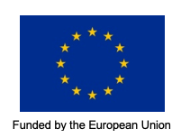

PIKE TREND ANALYSIS USING THE LEAST-SQUARES MEANS APPROACH IN R
================
CITES MIKE PROGRAMME – CENTRAL COORDINATION UNIT (CCU)  
August 1, 2019

     

**R script for analysis of MIKE data for reporting to CITES**

This repository contains R script for analyse of data from the [Monitoring the Illegal Killing of Elephants (MIKE) Programme](https://www.cites.org/eng/prog/mike/index.php) to produce outputs for reports to the [Convention for International Trade in Endangered Species of Wild Fauna and Flora (CITES)]( https://cites.org/eng).

The MIKE Programme is a site-based system designed to monitor trends in the illegal killing of elephants, build management capacity and provide information to help range States make appropriate management and enforcement decisions. MIKE evaluates relative poaching levels based on the Proportion of Illegally Killed Elephants (PIKE), which is calculated as the number of illegally killed elephants found divided by the total number of elephant carcasses encountered, aggregated by site and across year.

R code to determine PIKE trend based on least-squares means (LSMEANS) approach for Africa and its subregions and also for Asia can be found in the in the R Markdown document: *190801_PIKETrendUsingLSMEANS.Rmd*, under the subdirectory *RCODE*. 

This document contains information on the LSMEANS approach and software documentation for the code; in addition,  it contains background material  on the MIKE programme, MIKE data set, PIKE calculation and references.  A sample report generated from the  R markdown document is stored in the file *190801_PIKETrendUsingLSMEANS.pdf*.

PIKE trend, based on least-squares means (LSMEANS), is reported to the 15th, 16th, 17th and 18th meetings of the Conference of the Parties to CITES:

*	CoP15, Doha, 2010, in document CoP15 Doc. 44.2 (Rev. 1); 
*	CoP16, Bangkok, 2013, in document CoP16 Doc. 53.1; 
*	CoP17, Johannesburg, 2016, in document CoP17 Doc. 57.5; and 
*	CoP18, Geneva, 2019, in document CoP18 Doc. 69.2 and CoP18 Doc. 69.2 Addendum

And the 61st, 62nd, 65th, 66th, 69th and 70th meetings of the CITES Standing Committee:

*	SC61, Geneva, 2011, in document SC61 Doc 44.2 (Rev. 1) and its Annex 1 
*	SC62, Geneva, 2012, in document SC62 Doc 46.1 (Rev. 1) and its Annex 1
*	SC65, Geneva, 2014, in document SC65 Doc. 42.1
*	SC66, Geneva, 2016, in document SC66 Doc. 47.1
*	SC69, Geneva, 2017, in document SC69 Doc. 51.1 and its Annex
*	SC70, Russian Federation, in document SC70 Doc. 49.1 and its Annex 1

